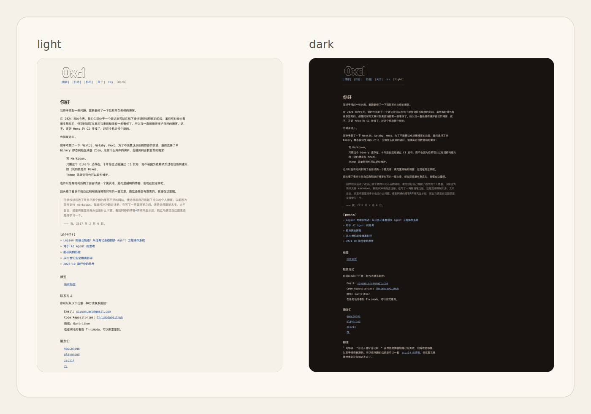

# cone-scroll

`cone-scroll` 是一个给 Zola 用的博客主题。最初是受到来自 [anemone](https://github.com/Speyll/anemone) 的启发，今天它已经脱胎换骨成了一个截然不同的主题了，因此它现在被单独拆出来了。

它不想把博客做成产品落地页，也不太想假装自己是终端。更接近它的比喻，也许是一张被认真排过版的索引页：暖纸色背景、窄一点的正文列、安静但好用的目录、还有一个不怎么吵闹的 ASCII 标题。

如果你喜欢 cards、hero、渐变光晕和一眼看完所有功能的首页，那它大概不太适合你。它更偏向“坐下来读一会儿”。



如果你更关心文章页，就再看这一张。亮色在左，暗色在右，TOC、meta 和正文列会一起出现在画面里。


## 它有什么

- 暖色 paper/ink 配色，带亮色 / 暗色两套主题
- 收窄的阅读宽度，适合长文章慢慢往下读
- 索引式首页、归档页和标签页，不走卡片路线
- 文本化的主题切换、RSS、标签、TOC rail
- 自带 `blog-page.html`、普通页、标签页、shortcodes、少量原生 JavaScript

## 安装

最省事的方式，是把这个目录整个放进你的站点 `themes/`：

```bash
mkdir -p themes
cp -R path/to/cone-scroll themes/cone-scroll
```

然后在站点的 `config.toml` 里启用它：

```toml
theme = "cone-scroll"

title = "你的博客"
description = "写点想写的东西"
default_language = "zh"
generate_feeds = true

taxonomies = [{ name = "tags", feed = true }]

[extra]
author = "你的名字"
display_author = true
favicon = "favicon.ico"
default_theme = "light"
twitter_card = true

header_nav = [
  { url = "/blog", name_zh = "|博客|" },
  { url = "/diary", name_zh = "|日志|" },
  { url = "/about", name_zh = "|关于|" },
]
```

如果你开了多语言，导航项按现有模板约定写成 `name_<lang>`，例如 `name_zh`、`name_en`。

## 页面约定

如果你希望博客文章和日志文章都使用主题里的文章模板，可以在对应 section 里这样写：

```toml
+++
title = "博客归档"
sort_by = "date"
page_template = "blog-page.html"
+++
```

长文章默认会在有标题层级时显示 TOC。若你想手动关掉，可以在页面 front matter 里写：

```toml
[extra]
toc = false
```

## 带点脾气的默认值

这不是一个追求“拿来就能覆盖所有博客形态”的主题，它有一些很明确的偏好：

- 默认壳层文案偏中文语境，适合中文站点直接起步
- 首页、归档和标签页强调“索引感”，不是摘要卡片墙
- `blog-page.html` 里带着一段 giscus 挂载代码；如果你不用它，删掉或替换成自己的配置就好
- 主题本身不提供 favicon，请把站点自己的 `favicon.ico` 放在根目录 `static/` 下，并在 `config.extra.favicon` 里指向它

## 目录结构

主题本体很简单：

```text
cone-scroll/
├── theme.toml
├── README.md
├── screenshot.svg
├── templates/
└── static/
```

没有构建链，没有额外打包步骤。大部分东西都在模板、CSS 和一个小小的 `script.js` 里。

## License

MIT。
